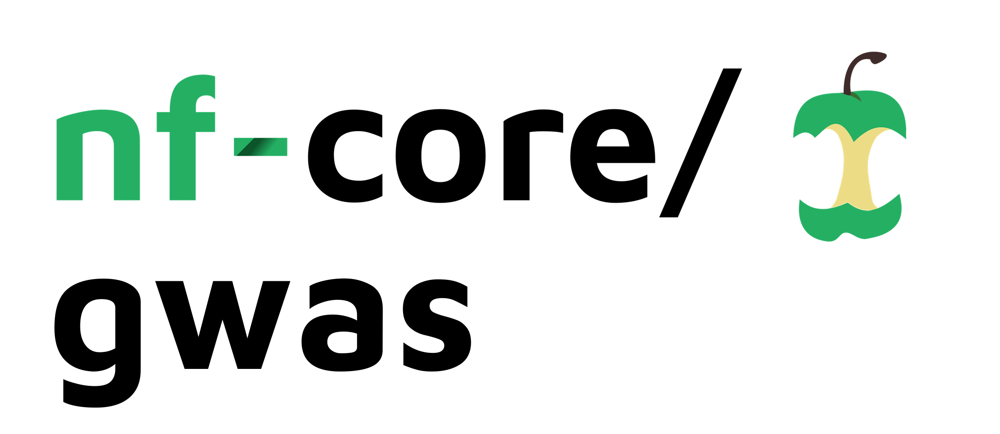

# 

**This is a new skeleton pipeline**.

[](https://github.com/nf-core/gwas/actions)
[](https://github.com/nf-core/gwas/actions)
[](https://www.nextflow.io/)

[](https://bioconda.github.io/)
[](https://hub.docker.com/r/nfcore/gwas)
[](https://nfcore.slack.com/channels/gwas)

## Introduction

The pipeline is built using [Nextflow](https://www.nextflow.io), a workflow tool to run tasks across multiple compute infrastructures in a very portable manner. It comes with docker containers making installation trivial and results highly reproducible.

## Quick Start

1. Install [`nextflow`](https://nf-co.re/usage/installation)

2. Install any of [`Docker`](https://docs.docker.com/engine/installation/), [`Singularity`](https://www.sylabs.io/guides/3.0/user-guide/) or [`Podman`](https://podman.io/) for full pipeline reproducibility _(please only use [`Conda`](https://conda.io/miniconda.html) as a last resort; see [docs](https://nf-co.re/usage/configuration#basic-configuration-profiles))_

3. Download the pipeline and test it on a minimal dataset with a single command:

    ```bash
    nextflow run nf-core/gwas -profile test,<docker/singularity/podman/conda/institute>
    ```

    > Please check [nf-core/configs](https://github.com/nf-core/configs#documentation) to see if a custom config file to run nf-core pipelines already exists for your Institute. If so, you can simply use `-profile <institute>` in your command. This will enable either `docker` or `singularity` and set the appropriate execution settings for your local compute environment.

4. Start running your own analysis!

    <!-- TODO nf-core: Update the example "typical command" below used to run the pipeline -->

    ```bash
    nextflow run nf-core/gwas -profile <docker/singularity/podman/conda/institute> --input samplesheet.csv --genome GRCh37
    ```

See [usage docs](https://nf-co.re/gwas/usage) for all of the available options when running the pipeline.

## Documentation

The nf-core/gwas pipeline comes with documentation about the pipeline: [usage](https://nf-co.re/gwas/usage) and [output](https://nf-co.re/gwas/output).

<!-- TODO nf-core: Add a brief overview of what the pipeline does and how it works -->

## Credits

nf-core/gwas was originally written by Abhinav Sharma, Raquel Dias, Alain Coletta.

## Contributions and Support

If you would like to contribute to this pipeline, please see the [contributing guidelines](.github/CONTRIBUTING.md).

For further information or help, don't hesitate to get in touch on the [Slack `#gwas` channel](https://nfcore.slack.com/channels/gwas) (you can join with [this invite](https://nf-co.re/join/slack)).

## Citation

<!-- TODO nf-core: Add citation for pipeline after first release. Uncomment lines below and update Zenodo doi. -->
<!-- If you use  nf-core/gwas for your analysis, please cite it using the following doi: [10.5281/zenodo.XXXXXX](https://doi.org/10.5281/zenodo.XXXXXX) -->

You can cite the `nf-core` publication as follows:

> **The nf-core framework for community-curated bioinformatics pipelines.**
>
> Philip Ewels, Alexander Peltzer, Sven Fillinger, Harshil Patel, Johannes Alneberg, Andreas Wilm, Maxime Ulysse Garcia, Paolo Di Tommaso & Sven Nahnsen.
>
> _Nat Biotechnol._ 2020 Feb 13. doi: [10.1038/s41587-020-0439-x](https://dx.doi.org/10.1038/s41587-020-0439-x).
> ReadCube: [Full Access Link](https://rdcu.be/b1GjZ)
